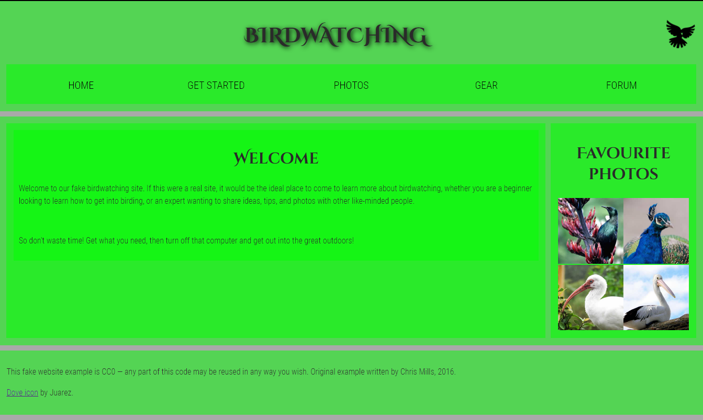

# Examen Birdwatching
***
<h3>El objetivo de la practica es hacer una pagina web similar a la de la Imagen:</h3>


***
<h3>Explicación del código:</h3>

Lo mas importante ahora es hacer un <link> al **sytle.css**.


```<link href="style.css" rel="stylesheet">```  


Luego lo que hacemos es usando el **nav** para marcar el menu del header:
  
  ```
      <nav>
        <ul>
          <li><span>Home</span></li>
          <li><a href="#">Get started</a></li>
          <li><a href="#">Photos</a></li>
          <li><a href="#">Gear</a></li>
          <li><a href="#">Forum</a></li>
        </ul>
      </nav>
  ```


Ahora iniciamos el body con un **main**.


Ahora para marcar donde queramos que vaya el texto en la pantalla usaremos un **article** y una **section** para que se vea como queremos:


``` 
<main>
<article>
  <section>  

    <h2>Welcome</h2>
    <p>Welcome to our fake birdwatching site. If this were a real site, it would be the ideal place to come to learn more about birdwatching, whether you are a beginner looking      to learn how to get into birding, or an expert wanting to share ideas, tips, and photos with other like-minded people.</p>
   </section>

     <section>        
       <p>So don't waste time! Get what you need, then turn off that computer and get out into the great outdoors!</p>
     </section>
</article> 
```


Ahora lo unico que falta es colocar las imagenes a la derecha juntas, asi que usaremos un simple **aside**:
  
```
   <aside>
     <h2>Favourite photos</h2>
     <a href="favorite-1.jpg"></a>
     <a href="favorite-2.jpg"></a>
     <a href="favorite-3.jpg"></a>
     <a href="favorite-4.jpg"></a>
   </aside>
 </main>

```


Lo ultimo de la pagina web es la parte de abajo, llamada footer. Usaremos la etiqueta **footer**:

```
    <footer>
      <p>This fake website example is CC0 — any part of this code may be reused in any way you wish. Original example written by Chris Mills, 2016.</p>

      <p><a href="http://game-icons.net/lorc/originals/dove.html">Dove icon</a> by Juarez.</p>
    </footer>

```
***
